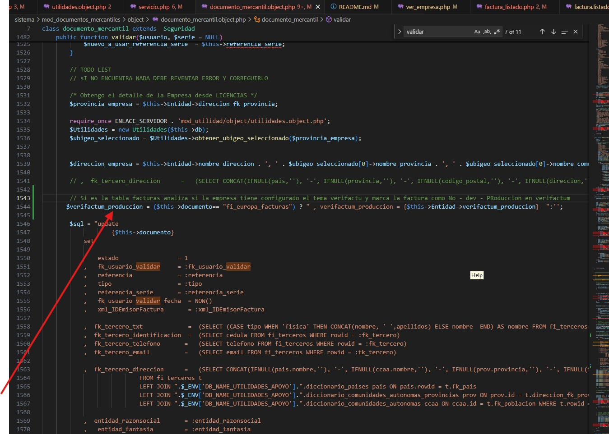

# 👨‍🏫 Configuración del Proyecto

## Configuración del Proyecto

### Uso del .env

1. Copiar el archivo `.env.example` y renombrarlo a `.env` en la raíz del proyecto.
2. Dentro de ese archivo se deben definir los enlaces de servidor y web, así como las credenciales de las bases de datos correspondientes.
3. Ya en el archivo vienen definidos unos de ejemplo que se deben adaptar al entorno local.

## Agregar una Nueva Ruta al Nginx Server (vhost)

1. Acceder al cloudpanel del server `64.23.179.230:8443`.
2. Entrar al sitio `sistema.avantecds.es`.
3. Ubicar en el menú la opción `vhost`.
4. Agregar la ruta deseada en el editor, ejemplo:

    ```nginx
    location /ver_albaran {
      rewrite ^/ver_albaran/(\w+)/?$ /dashboard.php?accion=ver_albaran&fiche=$1;
    }
    ```

5. Al guardar los cambios se caerá el SSL, para ello correr el siguiente comando como root:

    ```bash
    sudo certbot --nginx -d sistema-dev.avantecds.es
    ```

6. Presionar opción 1 en el prompt luego de ejecutar el comando y listo, se habrá regenerado el SSL.

# 😷 Clases Core

## Control de Errores SQL en los Objetos

Dentro del objeto en que estamos trabajando debemos extender mediante una extensión así:

```php
include_once(ENLACE_SERVIDOR . "mod_seguridad/object/seguridad.object.php");

class Productos extends Seguridad {
    // Código...
}
Después de ejecutar el Execute hacer lo siguiente:

php
$a = $dbh->execute();
if ($a) {
    $this->id = $datos->id;
    $resultado['id'] = $datos->id;
    $resultado['exito'] = $a;
    $resultado['mensaje'] = "Producto actualizado con éxito";
} else {
    $resultado['exito'] = 0;
    $resultado['mensaje'] = implode(", ", $dbh->errorInfo());
    $this->sql = $sql;
    $this->error = implode(", ", $dbh->errorInfo()) . " " . implode(", ", $this->db->errorInfo());
    $this->proceso = __FUNCTION__ . " del Objeto " . __CLASS__;
    $this->Error_SQL();
}
Anotaciones
Todas las clases deben llevar la primera letra en mayúscula.

php
require_once ENLACE_SERVIDOR . 'mod_crm/object/oportunidad.object.php';
$Oportunidad = new Oportunidad($dbh, $_SESSION['Entidad']);
Ejemplo de Uso de la Clase CSRFToken
Este es un ejemplo de cómo puedes usar la clase CSRFToken en tu aplicación PHP para proteger tus formularios contra ataques CSRF.

Instanciar la Clase CSRFToken
Primero, debes instanciar la clase CSRFToken en tu script PHP:

php
<?php
session_start();
require_once('CSRFToken.php');

// Crear una instancia de la clase CSRFToken
$csrfToken = new CSRFToken();
Generar y Usar Tokens CSRF
Una vez que hayas instanciado la clase CSRFToken, puedes generar y utilizar tokens CSRF en tus formularios HTML:

php
<?php
// Generar un token CSRF para un formulario específico
$formName = 'formulario1';
$token = $csrfToken->generateToken($formName);

// En el formulario HTML, agregar un campo oculto que contenga el token CSRF
?>
<form action="procesar_formulario.php" method="post">
    <input type="hidden" name="csrf_token" value="<?php echo $csrfToken->getToken($formName); ?>">
    <!-- Resto de los campos del formulario -->
    <button type="submit">Enviar</button>
</form>
Procesar el Formulario y Validar el Token CSRF
En el script PHP que procesa el formulario, debes verificar el token CSRF antes de realizar cualquier acción:

php
<?php
if ($_SERVER['REQUEST_METHOD'] === 'POST') {
    if (isset($_POST['csrf_token']) && $csrfToken->verifyToken($formName, $_POST['csrf_token'])) {
        // El token CSRF es válido, procesar el formulario
    } else {
        // El token CSRF no es válido, manejar el error
    }
}
?>
Este es un ejemplo básico de cómo puedes usar la clase CSRFToken para proteger tus formularios contra ataques CSRF en tu aplicación PHP. Asegúrate de incluir la clase CSRFToken.php en tu proyecto y seguir las instrucciones proporcionadas aquí para integrarla correctamente en tus formularios.

🛠 Bases de Datos
Diagrama de la Base de Datos
Explicación de las BD:

Licencias: Parte de licencias y usuarios.

Log: Para guardar los fallos y las partes operativas que son horizontales a todas las BD.

utilidades_apoyo: Tablas de diccionario que no son editables y aplican para todas las Empresas.

facturas_001: Operativas.

❤️ Importante: Cada usuario de la BD creado para ser operativo debe tener:

Escritura en la BD operativa que corresponda.

Escritura en la BD de LOG (Para escribir los errores).

Lectura en utilidades_apoyo.


## Agregar un menú y módulo nuevos
1. Agregar la ruta en el archivo `.htaccess`
2. Por ejemplo, si deseamos agregar el módulo mod_direcciones. Sería de la siguiente manera:
    #Mod Direcciones
    RewriteRule ^direcciones/?$    			dashboard.php?accion=direcciones
3. Abrir el archivo `\mod_switch\tpl\switch.tpl.php`y agregarle el menú que se desee agregar:
    case 'direcciones': $tpl = "mod_direcciones/tpl/listado_direcciones.php"; break;
4. Crear la estructura del módulo nuevo en donde corresponda. Por ejemplo en 
    `sistema\mod_direcciones` y dentro, agregar las carpetas conocidas:
    `tpl`, `object`, `ajax`


## Verifactu


❤️ Definicion para los servicios de Verifactu
Esto se configura en C:\laragon\www\facturacion-electronica-europa\sistema\mod_empresa\tpl\ver_empresa.php

0-> Sin Verifactu
1-> Dev
3-> Produccion 


En la tabla fi_europa_facturas es el campo verifactum_produccion
Se actualiza en el proceso Validar de Documento Mercantil 



El proceso de Envio esta en el dominio verifactum


